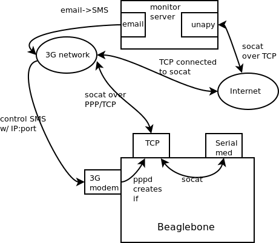

High Level Overview
===================

# Hardware #

The systems involved

* Beaglebone with insulaudit-image from meta-insul
* 3G modem connected to beaglebone
* Server running some kind of web service

# High Level Blocks/Connections #

The devices in the system are connected as follows

The beaglebone talks SMS and TCP through the 3G network. 
Something like unapy will handle the SMS and configuring socat/ports. 
The server can talk TCP via internet and e-mail to SMS gateway. 
Socat running on the 'bone will talk connect a TCP port to the medical device

# Interactions #

First, Alice comes along with a new device

1. Alice comes along, creates an account and puts in the serial number of devices she owns. 

2. Alice plugs in 3G modem with any devices she owns.

3. The modem sends an SMS to a known number with a unique key generated by something like the 'bone serial number. The ip:port stuff is stored somewhere in a config file.

4. The server responds with an ip:port combo. Also sends an auth key (two way authentication!)

Second, the everyday flows are done periodically

1. When the 'bone boots up it fires up the modem and PPP. There should be a file somewhere that loads in ip:port info.

2. The 'bone connects to ip:port and sends serial # of connected medical devices. (always send an authentication key)

3. The server responds that this device has been verified to belong to this user based on that auth key and serial number. 

4. The 'bone sends a note over TCP that the device is ready. (Three way handshake!)

5. The 'bone starts socat to connect ip:port to serial port with med device.

6. The server can start talking serial/wahtever to the medical device. (it would be nice to authenticate this, not sure of the practicality)

The above flows are illustrated here.

